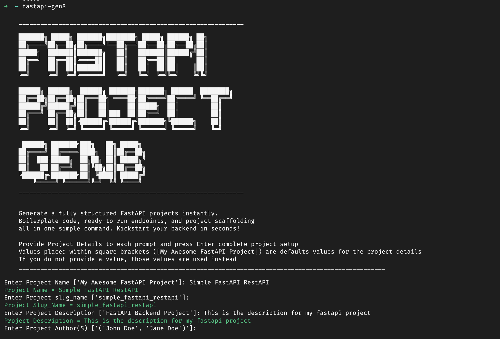

# FastAPI Gen8

FastAPI Project Gen8 is a lightweight command-line tool designed to generate clean, structured, production-ready FastAPI project scaffolds at warp speed.

______________________________________________________________

    ███████╗ █████╗ ███████╗████████╗ █████╗ ██████╗ ██╗
    ██╔════╝██╔══██╗██╔════╝╚══██╔══╝██╔══██╗██╔══██╗██║
    █████╗  ███████║███████╗   ██║   ███████║██████╔╝██║
    ██╔══╝  ██╔══██║╚════██║   ██║   ██╔══██║██      ██║
    ██║     ██║  ██║███████║   ██║   ██║  ██║██║    ║██║
    ╚═╝     ╚═╝  ╚═╝╚══════╝   ╚═╝   ╚═╝  ╚═╝╚═╝    ╚╝╚╝

    ██████╗ ██████╗  ██████╗ ███████╗███████╗ ██████  ████████╗
    ██╔══██╗██╔══██╗██╔═══██╗ ════██╗██╔════╝██╔════╝ ╚══██╔══╝
    ██████╔╝██████╔╝██║   ██║     ██║█████╗  ██║         ██║
    ██╔═══╝ ██╔══██╗██║   ██║███  ██║██╔══╝  ██║         ██║
    ██║     ██║  ██║╚██████╔╝██████╔╝███████╗╚██████╗    ██║
    ╚═╝     ╚═╝  ╚═╝ ╚═════╝ ╚═════╝ ╚══════╝ ╚═════╝    ╚═╝

     ██████╗ ███████╗███╗   ██╗███████╗ █████╗
    ██╔════╝ ██╔════╝████╗  ██║██╔════╝██╔══██╗
    ██║  ███╗█████╗  ██╔██╗ ██║█████╗   █████╔╝
    ██║   ██║██╔══╝  ██║╚██╗██║██╔══╝  ██╔══██╗
    ╚██████╔╝███████╗██║ ╚████║███████╗ █████╔╝
        ╚═════╝ ╚══════╝╚═╝  ╚═══╝╚═══╝ ╚════╝
______________________________________________________________

Generate functional FastAPI projects in seconds 🚀

## Overview

FastAPI Gen8 removes the repetitive setup that stands between an idea and a running API. A single command scaffolds a clean, opinionated FastAPI project — routers, models, services, middleware, a mailer, a Redis manager, Alembic migrations, logging, and tests — then wires up Git, a virtual environment, and a license. You go from `pip install` to writing endpoints in under a minute, instead of copy-pasting boilerplate from your last project.

## Use Cases

Reach for Gen8 whenever the setup is the boring part:

- **New microservice** — stand up a service with a consistent, production-ready layout in seconds.
- **Prototyping** — validate an idea without hand-rolling structure you'll throw away.
- **Hackathons & time-boxed builds** — spend your minutes on features, not folder trees.
- **Consistency across a team or portfolio** — every service starts from the same conventions, so switching between them is frictionless.
- **Teaching & workshops** — hand learners a ready-to-run FastAPI baseline instead of a blank folder.

## Prerequisites

Gen8 itself only needs **Python** and **Git**. Before igniting the generator:

- Create a remote Git repository for your new project (Gen8 will link it as `origin`).

The following are prerequisites for *running the FastAPI project you generate* —
not for Gen8 itself — so set them up when you're ready to run your new app:

- Optionally, a database (e.g. Postgres, MySQL) for your FastAPI app.
- A Redis server for your FastAPI app.

Gen8 will automatically initialize Git and link your project to the remote origin you provide.

## Features

- Instant FastAPI project scaffold.
- Automatic Git initialization + remote origin setup.
- Generates a `LICENSE` file for your chosen license (MIT, BSD, GPLv3, or Apache 2.0), pre-filled with the current year and author.
- Clean directory structure and preconfigured templates.
- Opinionated defaults with sensible fallbacks.
- Fast, simple, and repeatable.

## Quick Start

Install from PyPI:

```bash
pip install fastapi-gen8
```

Run the generator and follow the prompts:

```bash
fastapi-gen8
```



### Answering the prompts

Gen8 walks you through a short series of questions. Each shows a default in
`[brackets]` — press **Enter** to accept it, or type your own value:

| Prompt | What it's for |
| --- | --- |
| **Name** | Human-readable project name; becomes the API title in the docs. |
| **Slug** | Folder name for the project (defaults to a slugified name). |
| **Description** | Shown as the API summary in the generated OpenAPI docs. |
| **Version** | Initial project version. |
| **Repository link** | Your remote Git URL; Gen8 links it as `origin`. |
| **License** | MIT, BSD, GPLv3, Apache 2.0, or "Not open source" — generates a matching `LICENSE`. |

### What happens next

Once you've answered the prompts, Gen8:

1. Clones the standard FastAPI template into a folder named after your slug.
2. Fills in your project details (name, version, description) across the project's files.
3. Generates a `LICENSE` file for your chosen license.
4. Resets Git history and re-initializes the repo, linking your remote as `origin`.
5. Creates a virtual environment and installs the project's dependencies.

Then finish setup in your new project: update the `.env` file, activate the
virtual environment, and run the included test suite. The generated project
ships with its own README and a comprehensive set of unit tests to get you going.

## Project Structure
A typical generated project looks like:

```
<project_slug_name>/
├── app/
│   ├── __init__.py
│   ├── main.py
│   ├── api_router.py
│   ├── dependencies.py
│   ├── logger.py
│   ├── middlewares.py
│   ├── mailer.py
│   ├── redis_manager.py
│   ├── routers/
│   ├── models/
│   ├── services/
│   └── utils/
├── requirements.txt
├── alembic/
├── alembic.ini
├── .gitignore
├── README.md
└── ...
```

## Why FastAPI Gen8?

- Because the world moves too fast for boilerplate.
- Because creativity should start at the endpoint, not the folder tree.
- Because momentum matters — and FastAPI Gen8 gives you that first push.

## Development

This repository is the **generator CLI**. The FastAPI template it clones lives in a
[separate repository](https://github.com/brianobot/fastAPI_project_structure).

```bash
# Run the CLI from a local checkout
python -m fastapi_gen8.main

# Run the test suite (uses hatch)
hatch run pytest

# Type-check
hatch run types:check

# Lint & format (isort, black, ruff, mypy) via pre-commit
pre-commit run --all-files
```

## License
- [MIT License](LICENSE)
